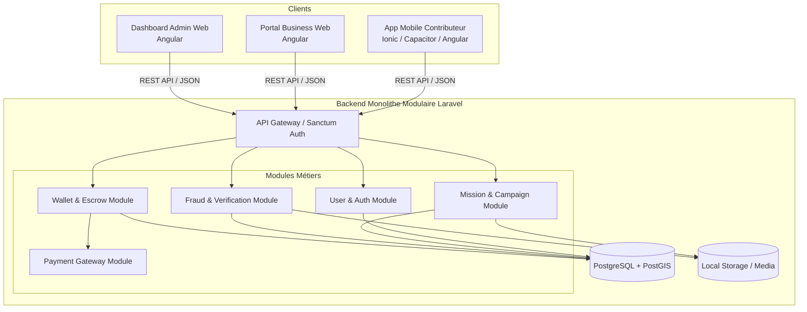

# Architecture Spine — SapSap Marketplace MVP

## Design Paradigm

SapSap suit un paradigme **Monolithe Modulaire Backend (Laravel API)** découplé de ses trois applications clientes front-end (**Application Mobile Contributeur Ionic/Capacitor/Angular**, **Portal Web Business Angular**, **Dashboard Web Admin Angular**).



## Invariants & Rules

### AD-1 — Monolithe Modulaire Backend API REST
- **Binds:** Tout le backend SapSap
- **Prevents:** La sur-ingénierie et la complexité opérationnelle prématurée des microservices au MVP.
- **Rule:** Le backend est développé comme un monolithe modulaire sous Laravel (PHP 8.3+) séparé en modules autonomes (`Auth`, `User`, `Campaign`, `Mission`, `Submission`, `Wallet`, `Fraud`, `Payment`).

### AD-2 — Frameworks Frontend & Unification Angular
- **Binds:** Applications web Business (`business.sapsap.bf`), Admin (`admin.sapsap.bf`) et mobile Contributeur
- **Prevents:** La dispersion technologique et le dédoublement des compétences sur des stacks différentes.
- **Rule:** Les applications web Business et Admin sont développées en Angular 18+. L'application mobile Contributeur repose sur Ionic 8 + Capacitor 6 + Angular 18.

### AD-3 — Base de Données Relationnelle & Extensions Spatiales
- **Binds:** Couche de stockage de données
- **Prevents:** Des calculs de distance GPS lents et imprécis côté application.
- **Rule:** PostgreSQL 16+ avec Eloquent ORM et l'extension `PostGIS` pour l'indexation spatiale des coordonnées de géolocalisation.

### AD-4 — Résilience Réseau Mobile (Online-First avec Retry UI)
- **Binds:** Application mobile Contributeur
- **Prevents:** La perte d'effort et de données utilisateur lors d'une baisse de réseau pendant l'envoi d'une mission.
- **Rule:** Soumission en ligne avec rétention en mémoire de l'état du formulaire et des photos compressées en cas d'échec réseau, permettant un ré-envoi instantané.

### AD-5 — Sécurisation Matérielle Mobile (Caméra & GPS Natifs)
- **Binds:** CAP-3, CAP-8
- **Prevents:** La soumission de photos préexistantes depuis la galerie ou de fausses géolocalisations.
- **Rule:** Prise de vue strictement contrainte à `@capacitor/camera` avec `CameraSource.Camera` (galerie bloquée). Compression d'image client (JPEG 80%, max 1920x1080). Validation de distance GPS serveur (<100m).

### AD-6 — Architecture de Paiement avec Simulated Payment Driver
- **Binds:** CAP-4, CAP-5, CAP-6
- **Prevents:** Le blocage des développements et des tests par l'absence d'identifiants d'agrégateur réel.
- **Rule:** Le module de paiement utilise le pattern `PaymentGatewayInterface` avec l'implémentation par défaut `SimulatedPaymentDriver`. Permet la simulation intégrale des dépôts et retraits Mobile Money (Orange/Moov Money).

### AD-7 — Registre Comptable Immuable à Partie Double (Wallet Ledger)
- **Binds:** CAP-4
- **Prevents:** Les incohérences de solde, les pertes de traçabilité et les risques de double dépense.
- **Rule:** Chaque mouvement d'argent est consigné dans la table `wallet_transactions` avec les états `initiated`, `escrow_locked`, `released`, `withdrawn`, `failed`, le solde avant/après et les identifiants de référence.

### AD-8 — Authentification Sanctum & RBAC Spatie
- **Binds:** CAP-1, CAP-5, CAP-7
- **Prevents:** Les accès non autorisés et le mélange des privilèges entre rôles.
- **Rule:** Tokens d'API gérés par Laravel Sanctum (OTP Téléphone pour mobile, Email/Password pour Web). Gestion des rôles Admin/Business via `spatie/laravel-permission` (`super-admin`, `validator`, `company-admin`, `company-viewer`).

### AD-9 — Stockage des Médias & Empreinte Anti-Fraude SHA-256
- **Binds:** CAP-3, CAP-8
- **Prevents:** La réutilisation frauduleuse de photos d'une mission à une autre ou d'un compte à un autre.
- **Rule:** Stockage local des photos sous `storage/app/public/submissions/`. Génération d'une empreinte `SHA-256` par photo à l'upload ; rejet automatique en cas d'empreinte déjà existante en base.

### AD-10 — Planificateur d'Auto-Validation à 48h
- **Binds:** CAP-4, CAP-7
- **Prevents:** Le blocage indéfini des paiements des contributeurs en cas d'inactivité du client ou de l'admin.
- **Rule:** Job planifié horaire Laravel Scheduler (`CheckPendingSubmissionsJob`) passant automatiquement en `validated` toute soumission en attente depuis plus de 48 heures.

## Consistency Conventions

| Domaine | Convention |
| --- | --- |
| **Nommage API** | RESTful snake_case (`/api/v1/campaigns/{campaign_id}/missions`) |
| **Format Réponses API** | Enveloppe JSON uniforme : `{ "success": boolean, "data": object\|array, "message": string, "errors": array\|null }` |
| **Horodatage** | ISO 8601 UTC (`YYYY-MM-DDTHH:mm:ssZ`) géré exclusivement par le serveur backend |
| **Identifiants** | UUID v4 pour toutes les entités exposées aux clients (`campaigns`, `missions`, `submissions`, `wallets`) |
| **Devises** | Montants enregistrés en FCFA (nombres entiers non décimaux) |

## Stack

| Élément | Technologie / Package | Version Pointee |
| --- | --- | --- |
| **Backend Framework** | Laravel | 11.x |
| **Langage Backend** | PHP | 8.3+ |
| **Base de Données** | PostgreSQL + PostGIS | 16.x |
| **Auth Backend** | Laravel Sanctum | 4.x |
| **Permissions** | Spatie Laravel-Permission | 6.x |
| **Framework Web** | Angular | 18.x |
| **Framework Mobile** | Ionic Framework + Capacitor | 8.x / 6.x |
| **Caméra Natif** | `@capacitor/camera` | 6.x |
| **GPS Natif** | `@capacitor/geolocation` | 6.x |

## Structural Seed

```text
SapSap/
├── backend/                  # Monolithe Modulaire Laravel 11 API
│   ├── app/
│   │   ├── Modules/
│   │   │   ├── Auth/
│   │   │   ├── Campaign/
│   │   │   ├── Mission/
│   │   │   ├── Submission/
│   │   │   ├── Wallet/
│   │   │   ├── Fraud/
│   │   │   └── Payment/
│   │   └── Jobs/
│   │       └── CheckPendingSubmissionsJob.php
│   └── database/migrations/
├── mobile-contributor/       # App Mobile Ionic 8 + Capacitor 6 + Angular 18
│   ├── src/app/
│   │   ├── pages/ (missions, activity, wallet, profile)
│   │   └── services/ (api, geo, camera, sync)
│   └── capacitor.config.ts
├── web-business/             # Portal Entreprise Angular 18
│   └── src/app/pages/ (dashboard, campaigns, results, billing)
└── web-admin/                # Dashboard Admin Angular 18
    └── src/app/pages/ (moderation, submissions, kyc, withdrawals)
```

## Capability → Architecture Map

| Capability | Module / Composant | Régit par |
| --- | --- | --- |
| **CAP-1** (Auth & Profil Contributeur) | `Auth Module` + `mobile-contributor/auth` | AD-1, AD-8 |
| **CAP-2** (Découverte & Réservation) | `Mission Module` + `mobile-contributor/missions` | AD-1, AD-3 |
| **CAP-3** (Exécution & Preuves) | `Submission Module` + `mobile-contributor/camera` | AD-4, AD-5, AD-9 |
| **CAP-4** (Portefeuille & Retraits) | `Wallet Module` + `mobile-contributor/wallet` | AD-6, AD-7, AD-10 |
| **CAP-5** (Campagnes Entreprises) | `Campaign Module` + `web-business/campaigns` | AD-1, AD-6, AD-8 |
| **CAP-6** (Suivi & Exports) | `Campaign Module` + `web-business/results` | AD-1, AD-2 |
| **CAP-7** (Admin & Modération) | `Submission Module` + `web-admin/moderation` | AD-1, AD-8, AD-10 |
| **CAP-8** (Anti-Fraude MVP) | `Fraud Module` + `Submission Module` | AD-5, AD-9 |

## Deferred

- **Déploiement Multi-Villes / International** : Réservé pour la phase P2.
- **Intégration d'un Agrégateur de Paiement Réel** : Remplacement du `SimulatedPaymentDriver` par le driver réel lorsque le contrat sera signé.
- **Application iOS Publique** : Réservé pour la phase P1.
- **Analyse IA des Photos & Reconnaissance Visuelle** : P2.
