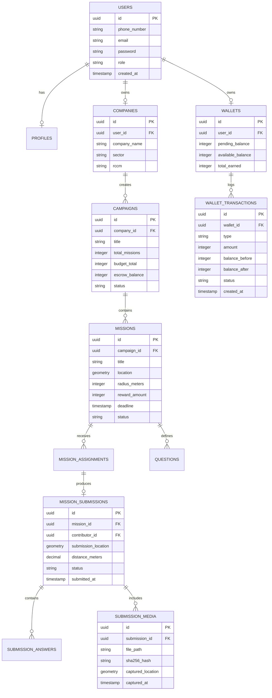
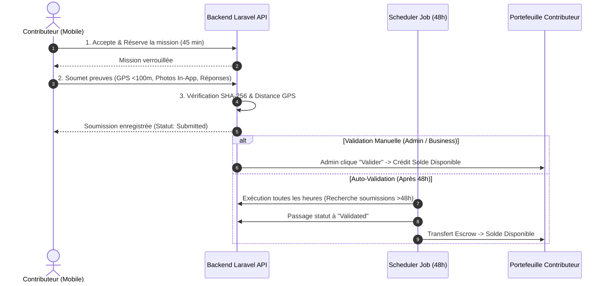
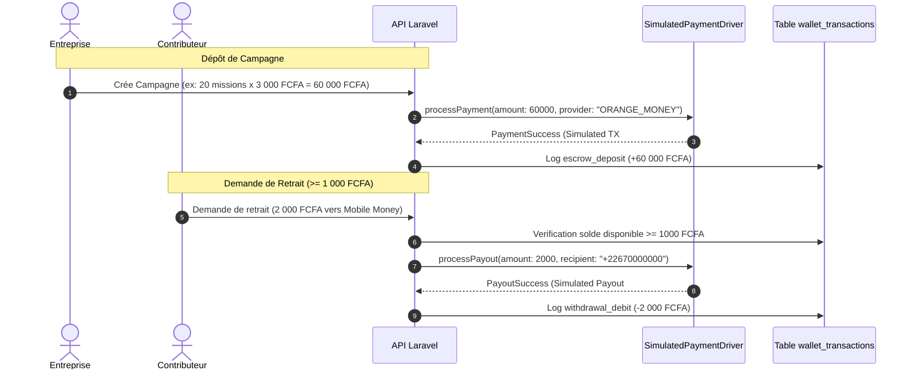

# Document de Conception de Solution Technique — SapSap MVP

**Projet :** SapSap (Marketplace B2B2C de Micro-Missions Terrain)  
**Marché Pilote :** Ouagadougou, Burkina Faso  
**Date :** 26 Août 2026  
**Statut :** Approuvé (Final)  

---

## 1. Vue d'Ensemble & Vision Architecturales

### 1.1 Contexte & Problématique
SapSap connecte les entreprises ayant besoin d'informations terrain vérifiées (présence produit, prix, affiches, audits, clients mystères) avec des personnes situées à proximité à Ouagadougou, capables de réaliser ces micro-missions rapidement via leur smartphone contre rémunération en Mobile Money.

### 1.2 Principes Directeurs
- **Simplicité Opérationnelle** : Choix d'un monolithe modulaire API REST sous Laravel 11 pour minimiser la complexité de déploiement et de maintenance au MVP.
- **Unification Frontend** : Utilisation d'Angular 18 pour toutes les interfaces Web (Business et Admin) et Mobile (Ionic 8 + Capacitor 6) afin d'assurer une cohérence de code et une réutilisation maximale.
- **Rigueur Comptable & Simulation** : Architecture de portefeuille basée sur un registre immuable (`wallet_transactions`) avec un composant de paiement sous forme de Driver adaptable (`SimulatedPaymentDriver`), permettant de simuler l'intégralité des flux financiers sans attendre d'identifiants d'agrégateur réels.
- **Sécurité & Anti-Fraude Intégrées** : Empreintes numériques SHA-256 pour prévenir la réutilisation des photos, blocage strict de la galerie mobile et validation spatiale PostGIS (<100m).

---

## 2. Modèle de Données & Schéma de la Base de Données

Le backend utilise PostgreSQL 16 avec PostGIS. Voici les tables principales du domaine :

---

## 3. Flux des Processus Majeurs

### 3.1 Cycle de Vie d'une Mission & Auto-Validation 48h

### 3.2 Flux Financier & Driver de Simulation Mobile Money

---

## 4. Spécifications des Interfaces & Découpage des Projets

### 4.1 Monolithe Modulaire Backend (`/backend`)
- **Framework** : Laravel 11.x
- **Modules** :
  - `Auth` : Authentification Sanctum (OTP & Email/Password).
  - `Campaign` : Gestion des campagnes et tarification.
  - `Mission` : Publication, réservation et géolocalisation.
  - `Submission` : Contrôles de soumission et traitement des photos.
  - `Wallet` : Registre comptable, crédits/débits et driver de simulation.
  - `Fraud` : Détection des doublons par hash SHA-256.

### 4.2 Application Mobile Contributeur (`/mobile-contributor`)
- **Stack** : Ionic 8 + Capacitor 6 + Angular 18.
- **Pages** :
  - `Missions` : Liste et Carte des opportunités autour de l'utilisateur.
  - `MissionDetail` : Exécution avec vérification GPS et caméra native.
  - `Activity` : Suivi de l'état des soumissions (En vérification, Validé, Rejeté).
  - `Wallet` : Consultation des soldes et demande de retrait (>= 1 000 FCFA).

### 4.3 Portail Business (`/web-business`)
- **Stack** : Angular 18 + TailwindCSS.
- **Fonctionnalités** : Wizard de création de campagne, suivi de complétion, visualisation des preuves terrain sur carte et export CSV/Excel.

### 4.4 Dashboard Admin (`/web-admin`)
- **Stack** : Angular 18 + TailwindCSS.
- **Fonctionnalités** : Modération des campagnes, revue des soumissions de missions, gestion KYC et suivi des retraits.

---

## 5. Stratégie de Recette & Vérification

1. **Tests unitaires & d'intégration (Backend Laravel)** : `php artisan test` pour valider le calcul des règles de distance Haversine, le hashage SHA-256 et le registre comptable.
2. **Simulation d'auto-validation 48h** : Test du job `CheckPendingSubmissionsJob` avec fausses dates de soumission.
3. **Tests Mobile (Capacitor)** : Validation du blocage de l'accès à la galerie photo sur émulateur Android.
